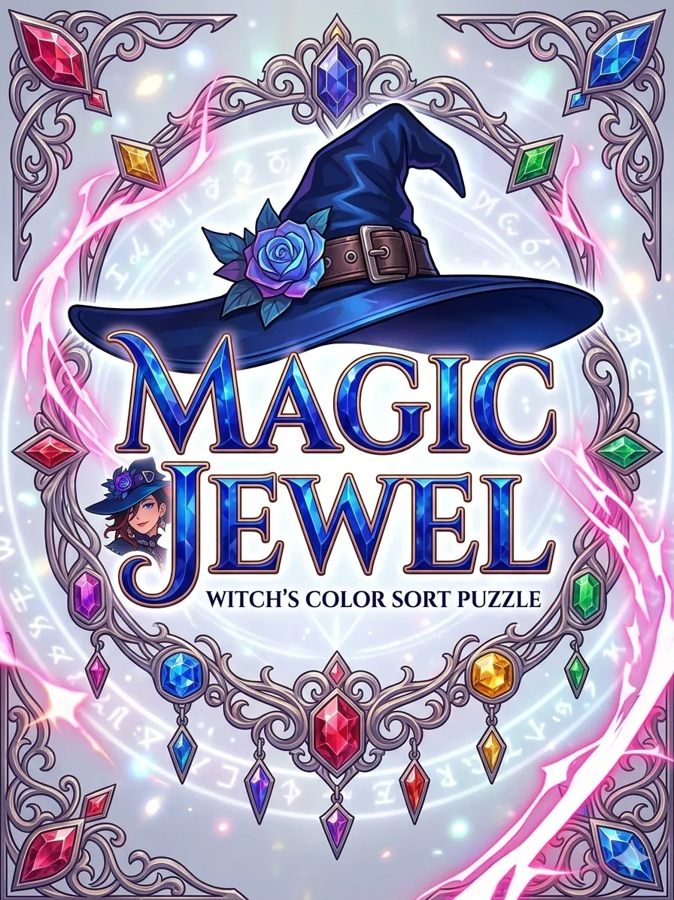
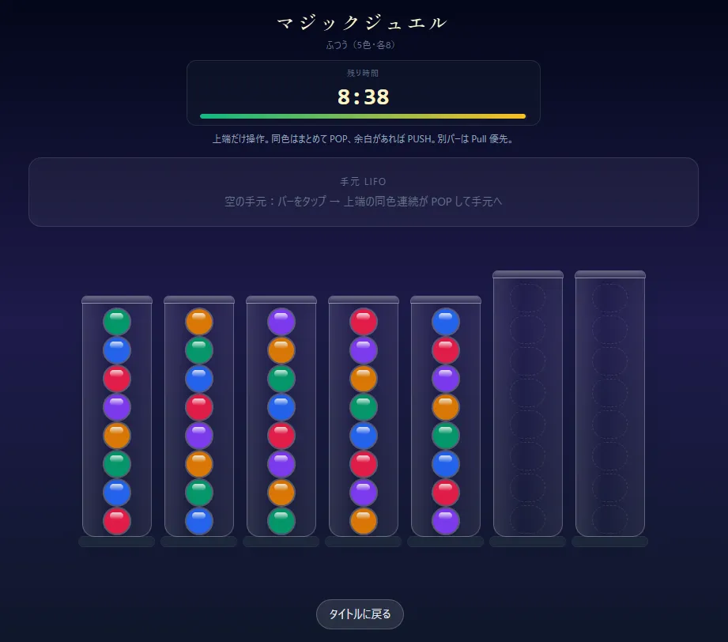

# マジックジュエル（MagicJewel）

同色系パズル系のブラウザゲームです。単一の `index.html` に UI（Tailwind）とゲームロジック（バニラ JS）がまとまっています。

  

## 代表的なキャラクター

  

## プレイ画面

  

---

## このプロジェクトで採用している設計（`doc/memo.md` のどれか）

[`doc/memo.md`](doc/memo.md) にある選択肢のうち、**次の組み合わせ**で実装されています。以降の追記・バイブコーディングでは、このルールに合わせると破綻しにくいです。

| 区分 | 採用 | メモにあった別案 |
|------|------|------------------|
| **スタイル** | **Tailwind CSS** | Bootstrap など |
| **ロジックの書き方** | **ES6 のクラスを使ったオブジェクト指向**（`JewelBuffer` / `MagicJewelGame`） | 手続き型のみ |
| **変数名** | **キャメルケース** | スネークケースなど |
| **状態と描画** | **状態はゲームクラス／描画は `render*` に集約** | （メモの「明確に分離」に相当） |
| **時間まわり** | 制限時間は **`setInterval`**（1 秒ごと）。連続アニメのゲームループではないので **`requestAnimationFrame` は未使用** | rAF や Phaser など |

`memo.md` 末尾のテンプレートなら、だいたい次の一言に相当します。

> JavaScript でゲームを作る。**スタイルは Tailwind CSS**、ロジックは **ES6 クラスのオブジェクト指向**。**変数名はキャメルケース**。**状態管理と描画ロジックは分離**する。

補足: 開発中の見た目は **Tailwind の CDN**（`index.html` 内）。コメントどおり、必要なら `npm run build:css` で `styles.css` を生成し、`<link>` に切り替える想定です。

---

## 触るとよい場所（次の改修の地図）

| 目的 | 主な場所 |
|------|----------|
| 難易度・初期配置・制限時間 | `LEVEL_INITIAL` / `LEVEL_TUBE_CAPACITY` / `LEVEL_TIME_SEC` |
| 色の定義・見た目クラス | `JEWEL_META`、テーマ色（`tailwind.config` または `tailwind.config =` の inline） |
| ルール本体 | `JewelBuffer`（LIFO）と `MagicJewelGame`（`tapTube` の分岐が仕様の中心） |
| DOM の更新 | `render` / `renderHand` / `renderTubes`、オーバーレイ表示 |
| デバッグログ | 先頭付近の `MJ_DEBUG` を `true` に |

---

## アセット

- タイトル: `img/title.webp`
- クリア時の魔女イラスト: `img/1.webp` … `img/5.webp`（ランダム）
- タイムアップ: `img/gameOver.webp`
- 本 README 用の参考画像の一例: `img/2.webp`

ライセンスやクレジットが必要な素材を足す場合は、この表に一行追記すると後から見つけやすいです。
